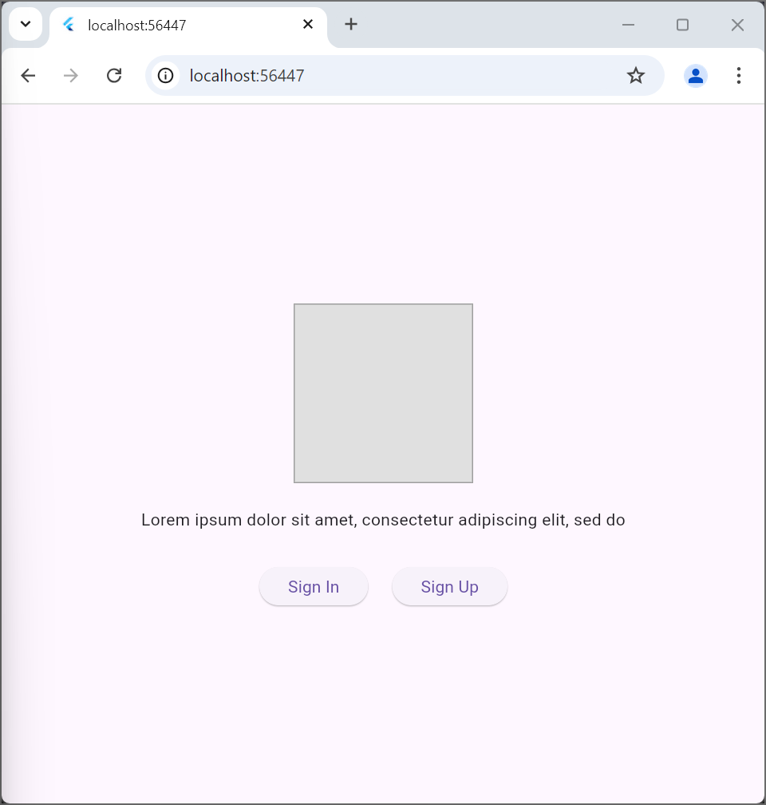
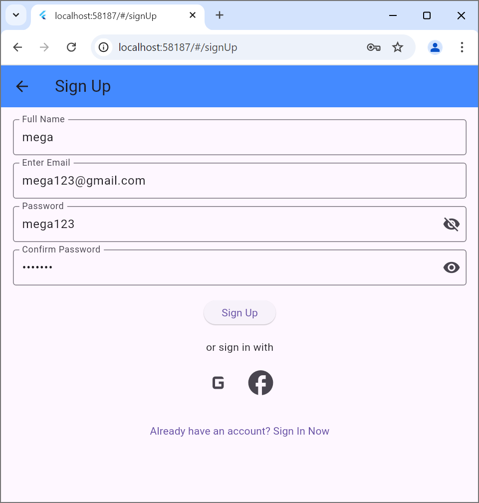
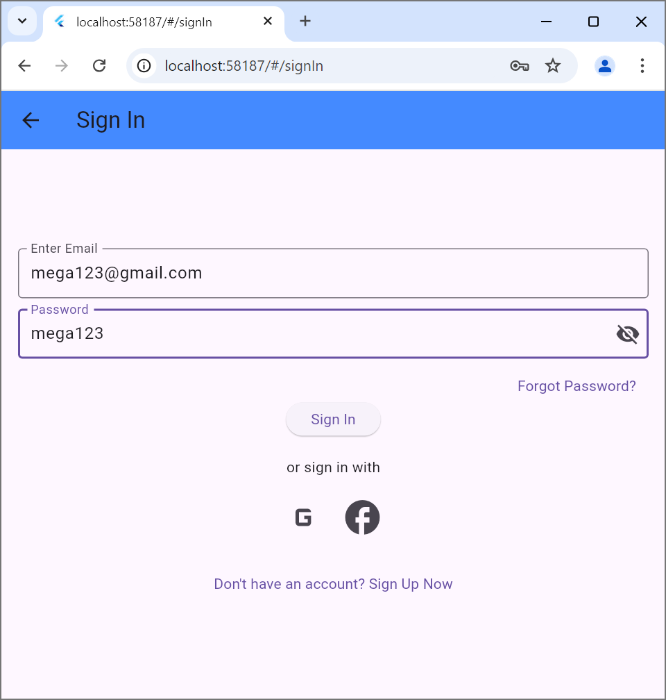
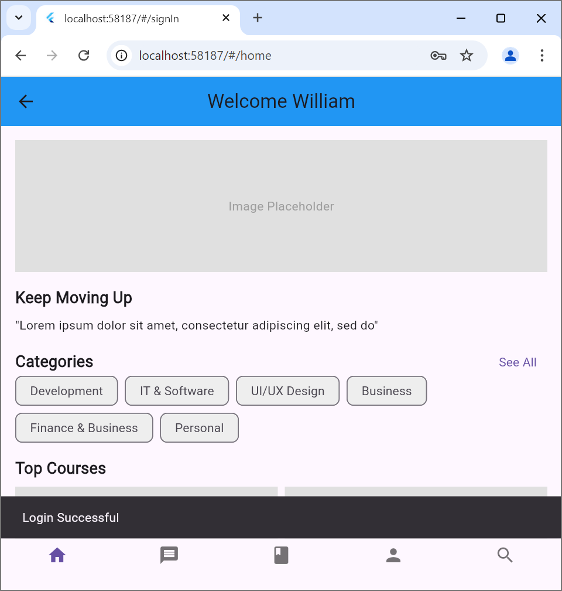
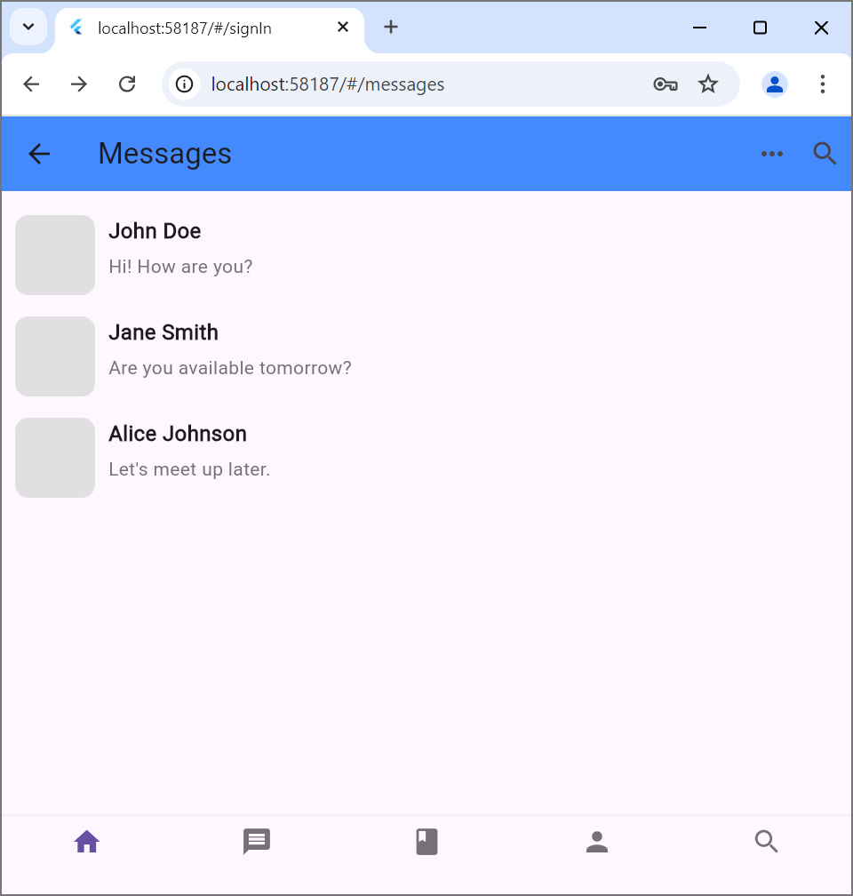
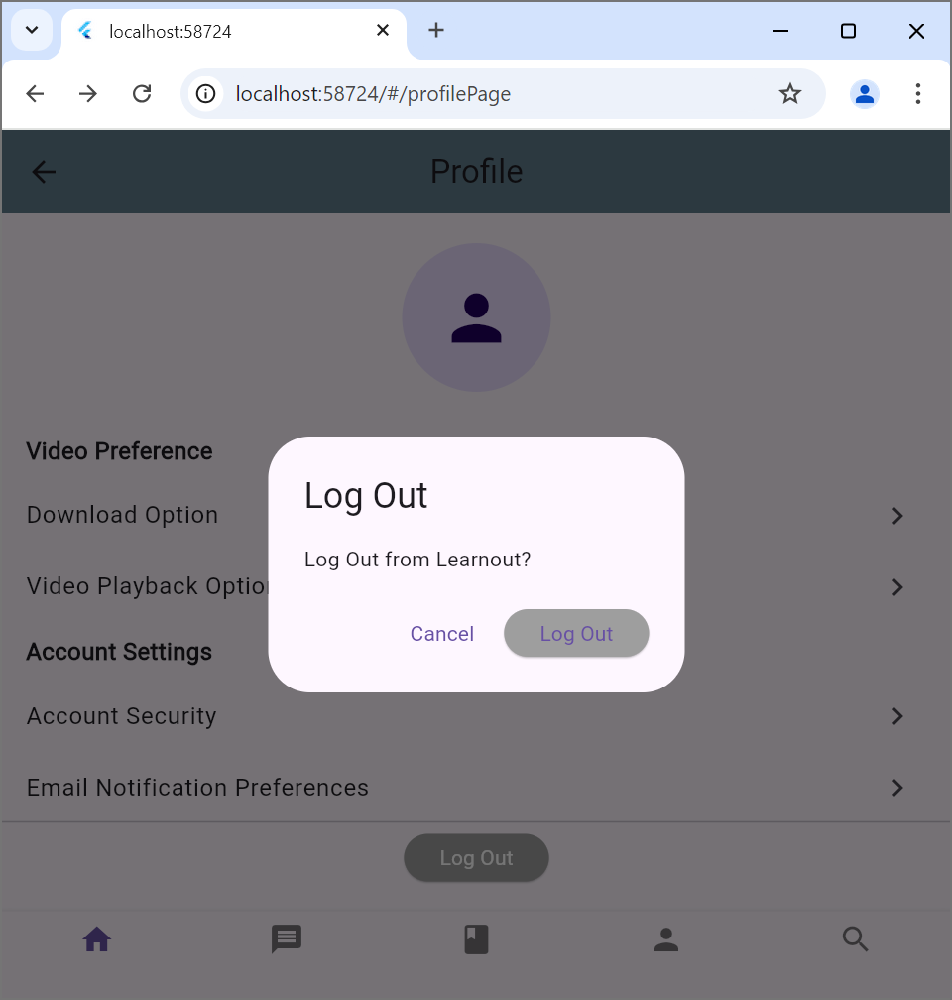
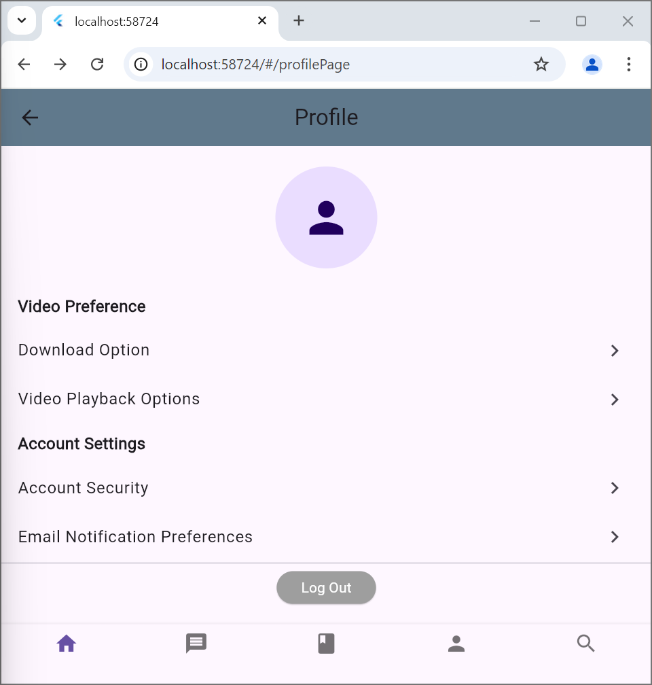

NIM   : 362358302010
Nama  : Mega Maharani
Kelas : 2A TRPL

1. 
ini adalah halaman awal ketika menjalankan aplikasi ini, disini user diminta memilih untuk login ketika sudah memiliki akun dan sign up jika belum mempunyai akun.

2. 
ketika memilih sign up maka user akan diminta untuk mendaftar dan mengisi nama, email, dan password yang akan digunakan untuk login ke aplikasi.
setelah data disisi dan diklik sign up maka akan diarahkan ke sign in

3. 
ketika user telah melakukan sign up atau sudah mempunyai akun, maka akan diminta untuk sign in menggunakan email dan password yang telah terdaftar untuk masuk ke aplikasi

4. 
setelah user melakukan sign in dengan email dan password yang telah terdaftar, maka akan di arahkan ke halaman home pada aplikasi 

5. 
ini adalah halaman dimana user dapat melihat daftar pesan,  daftar pesan disini diambil dari file datamessage.json yang berada dalam folder assets. data diambil menggunakan provider dan di tampilkan pada screen dengan memanfaatkan provider dan model.

6. 
ini adalah pop up yang akan muncul sebelum user log out, fungsinya memastikan bahwa user benar benar ingin log out dan menghindari user langsung log out ketika tombol log out tidak sengaja tertekan.

7. 
ini adalah halaman profile yang mana akan menampilkan profile dari user yang sedang login dan juga pengaturan untuk edit profile.  